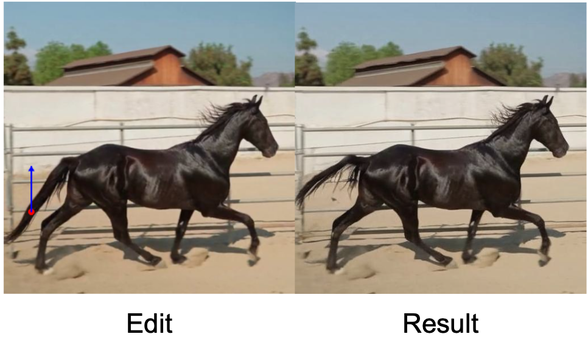
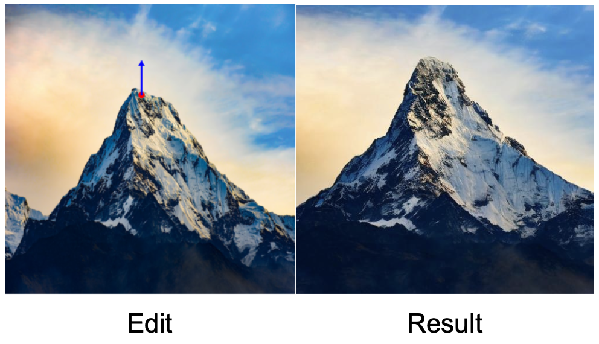
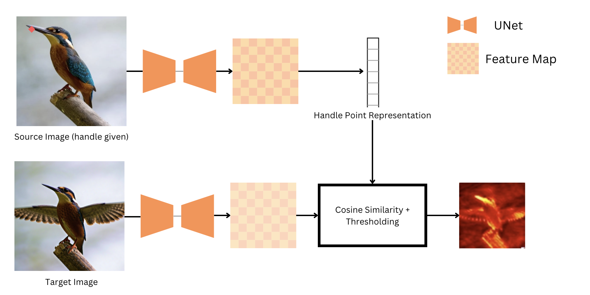

**Drag-Based Image Editing using Diffusion Models**

## Overview
Drag-based image editing is a style of image editing where the user can "drag" any points of the image to precisely reach target points. Successful drag-based editing involves moving the object as well as preserving the other details in the original image. This repository contains the code pertaining to an exploratory project that relies on using feature correspondences in large-scale diffusion models in order to perform Drag-based image editing. 

## Problem Setup
Given an image, the user has the option to specify 2 sets of points. These sets are called the handle points and target points, the goal of drag-based editing is to modify the image in a way such that the part of the image that the handle points refers to moves to the location specified by the target points. Here are a few examples,

  
  

  <strong>Figure 1:</strong> Moving the horse tail up. &nbsp;&nbsp;&nbsp;&nbsp; 
  <strong>Figure 2:</strong> Increasing the height of a mountain.

## Method
Drag-based editing relies on 3 important steps,
1. Identifying the part of the image corresponding to the handle point
2. Moving the identified object as per the edit instructions
3. Preserving the identity of the image in other places

On a high-level, we first identify the part of the image that needs to be edited. After this, we define an objective which measures the progress of the edit, we optimize this objective while also preserving the other details of the image which gives us an accurate edit. The specifics are given below,

## Identifying the Part to be Dragged in the Image 
We have a single point in our image as the input, we need to use that single point in order to identify the region to be dragged. We do so using feature correspondences. [DIFT](https://arxiv.org/abs/2306.03881) shows that the UNet used in large-scale text-to-image diffusion can be used to establish correspondences between real images. Our key idea is simple, use the feature vector in the UNet corresponding to the handle point, then identify the regions that are most similar (using cosine similarity). The pipeline can be found below,

*The handle point of the beaks in one of the birds can be used to detect the beak of another bird in a different position. We pass both images through the **diffusion model UNet** and extract their features. We then select the **feature vector** corresponding to the **handle point** and compute the **element-wise similarity** between the target image feature representation and our feature vector. With some **thresholding**, we can see that the beak can be exclusively identified using this approach.*

## Dragging the Identified part of the image
Now that we have a method to identify the part of the image corresponding to the handle point, our next objective is to move this part so that the handle point aligns with the target point. To achieve this, we incorporate additional guidance terms based on the [Self-Guidance](https://arxiv.org/abs/2306.00986) paper.

Our approach is straightforward: using the heatmap generated during the process, we calculate the average of the spatial locations, weighted by the similarity score. Intuitively, this centroid shows where the heat of the image is concentrated (and hence position of the handle point). This calculation yields the **centroid** of the part to be moved in a differentiable manner. At the starting point, this centroid is approximately aligned with the handle point.

More formally, given a spatial similarity heat map `H(x, y)` where each pixel value represents the similarity between with the handle point, we can compute the **centroid** of the heat distribution using a weighted average of the spatial locations. The computation can be expressed as follows:

$$
C = \frac{\sum_{x,y} (x, y) \cdot H(x, y)}{\sum_{x,y} H(x, y)}
$$

Where:
- **C** is the centroid of the heat map.
- **(x, y)** represents the spatial coordinates.
- **H(x, y)** is the heat value at the spatial location `(x, y)`.

After computing the position of the handle point in a differentiable manner, we then define a movement objective which we will use as an energy function for guidance, we define this function as follows,

$$
L_{\text{movement}} = |C_x - t_x| + |C_y - t_y|
$$

Where:
- **$L_{movement}$** is the L1 distance representing the movement required.
- **$C_x$** and **$C_{y}$** are the coordinates of the centroid **C**.
- **$t_{x}$** and **$t_{y}$** are the coordinates of the target point.

## Preserving the identity of the image

While making the edit, it is also important that we do not change the semantic content completely. Therefore, we introduce a preservation objective. We argue that most drag-based iamge edits do not change the rough appearence (colors, brightness etc) in an image. Based on this assumption, we preserve the average semantic content of the image. In order to do this, we first define the semantic content of an image using the spatial average of the feature map. This idea was inspired by the Self-Guidance and [Plug-and-Play](https://arxiv.org/abs/2211.12572) paper. We then enforce the objective which constrains the edited image to be as closely as possible to the original image. We call this objective as $L_{\text{appearence}}$, which is defined as follows,

$$
A = \frac{1}{h \cdot w} \sum_{i=1}^{h} \sum_{j=1}^{w} F_{i,j,:}
$$

Where:
- **A** is the resulting \( $dim$ \)-dimensional vector containing the spatial averages for each channel.
- **F(i, j, :)** represents all the values across channels at position \( (i, j) \).

Using these, we define our preservation objective as follows,

$$
L_{\text{appearance}} = \frac{1}{\text{dim}} \sum_{c=1}^{\text{dim}} (A_{\text{original}, c} - A_{\text{current}, c})^2
$$

Where:
- **$L_{appearance}$** represents the Mean Squared Error (MSE) loss between the original and current appearance feature vectors.
- **$A_{original}$** is the original \( $dim$ \)-dimensional feature vector.
- **$A_{current}$** is the current \( $dim$ \)-dimensional feature vector.
- **c** denotes the channel index, running from 1 to **dim**.

